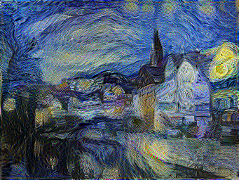
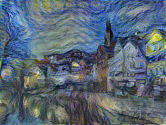

# Neural Style Transfer

This repository contains a collection of projects that re-implement a variety of papers relating to Neural Style
Transfer (NST), introduced by Gatys et al. in "A Neural Algorithm of Artistic
Style" [[1]](#1).

## Projects Within This Repository
### [NST for Images](#nst-for-images)
- **Status** Working on 2nd demo
- Try it out in [Colab](https://colab.research.google.com/drive/1_vnwvTRRpNOcql8vib8MigMU7yOkI8VP?usp=sharing)!
- Based on:
    - "A Neural Algorithm of Artistic Style" (Gatys et al.) [[1]](#1)
    - "Demystifying Neural Style Transfer" (Li et al.) [[2]](#2)

### Video Style Transfer
- **Status:** Reading finished, currently implementing
- "Real-Time Neural Style Transfer for Videos" (Huang et al.)

### 3D Video Style Transfer
- **Status:** Currently reading
- "Stereoscopic Neural Style Transfer" (Chen et al.)

## NST For Images
### Project 1.1: Base NST
This project is based on the paper that really kicked off the field of NST.
My implementation has two main goals:
1) **Stay as true as possible to the original implementation.** While there are
some optimizations that we could apply to get smoother results (e.g. different
way of computing style loss/gram matrix, or reducing noise with a total
variation regularizater).
2) **Organize the logic in a way that is easily comprehensible.** This includes
organizing methods by descending levels of abstraction, following the stepdown
rule from the book, Clean Code.

#### <ins>Fun Findings</ins>
**Average pooling >> Max Pooling**

The paper's authors recommend replacing VGG19's max pooling layers with average
pooling layers. However, in the initial phases of this project, I stuck to
using the VGG19 model as-is—I thought that the results would be fine.

The difference really is astounding, however.

The result with max pooling is shown on the left, and the result with average
pooling is shown on the right. Disclaimer: the right image was generated with
a slightly higher weight for style loss in order to make the results more
comparable.

The colors in the right image really do pop out more than those in the left
image. The figures also look more stable, especially the tower in the back. In the paper, the authors mention that using average pooling helps improve the "gradient flow".

### Project 1.2: Maximum Mean Discrepancy (MMD) NST
Through this project based on the paper by Li et al. [[2]](#2), I was able to gain a better understanding of how NST really works behind the scenes. I got to learn about types of problems categorized as "domain adaptation" problems, and was able to see how NST fits this description. By viewing the problem through this lens, the authors were able to try tackling NST with different tools that are commonly used to handle domain adaptation problems.

My main goal with this project was to **highlight the differences** between this paper and the paper by Gatys et al. by **inheriting** from my "base" implementation and only changing the necessary portions.

#### <ins>Fun (and not-so-fun) findings:</ins>
**MMD calculations require a lot of GPU RAM**

To my initial surprise, the MMD calculations required a huge amount of GPU RAM when compared to using the Gram matrices. For images with dimensions 256 x 341, when using the polynomial kernel for MMD NST (mathematically equivalent to Gram matrix NST), MMD NST requires **~30 Gigabytes** of GPU RAM, while Base NST requires no more than **10 Gigabytes**.

By stepping through my program, I was able to find that the matrix multiplications were causing my memory usage to skyrocket. To prevent this, I initially tried "partitioning" the features at each layer in order to run several, smaller calculations. However, once I reached the gradient calculations, the memory usage skyrocketted to roughly the same amount.

In the end, I settled for simply **shrinking the images even further**. In the future, I would love to try connecting my Colab to a GCE VM to run my code with much more VRAM.

**Finding a good normalizing term for $\pmb{Z_k^l}$**

The paper mentions a normalizing term, $Z_k^l$, for calculating the style loss for a given layer. However, this term was only given for the polynomial and batch norm (BN) kernels.

I initially looked at the original author's code to see what terms they used for $Z_k^l$, but I couldn't really understand their code, and wasn't sure if they were applying the normalization for certain kernels.

I reasoned out my own normalization terms for each kernel, following the idea that, regardless of the number of maps, the resulting style loss should give similar results. I chose the following terms:
- Linear Kernel: $\dfrac{1}{N_l}$
- Polynomial Kernel: $\dfrac{1}{N_l^2}$ (Derived in the paper as $\dfrac{4}{N_l^2}$ from Base NST)
- RBF/Gaussian Kernel: 1
- Batch Normalization (BN) Kernel: $\dfrac{1}{N_l}$ (Given in the paper)

Where $N_l$ is the number of maps in a given layer.

I was really struck when I figured out the normalization term for the RBF kernel. Taking a look at the polynomial kernel, we can reason that the result of $k(\mathbf{1_n}, \mathbf{1_n})$ should grow with $n$ as $O(n^2)$ (giving rise to our $\dfrac{1}{N_l^2}$ term). Unlike the other kernels, the range of values for the RBF kernel is constrained to \(0, 1\]. Because this range is unaffected by the dimensionality of the input vectors (which, in our case, is the number of maps $N_l$), **we don't have to worry about normalization for this kernel**!

## References
<a id="1">[1]</a> [A Neural Algorithm of Artistic Style](
https://doi.org/10.48550/arXiv.1508.06576)

<a id="2">[2]</a> [Demystifying Neural Style Transfer](https://doi.org/10.48550/arXiv.1701.01036)